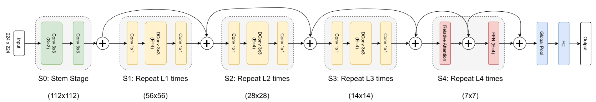
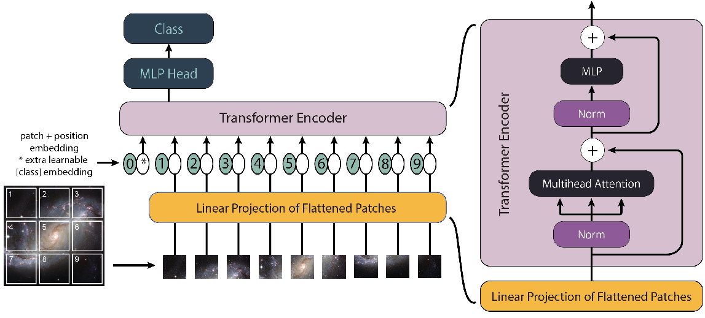

# AstroLens

A unified library of vision models for astronomy.

## Table of Contents

- [Usage](#usage)
- [Astroformer](#astroformer)
- [Linformer](#linformer)
- [GCNN](#gcnn)
- [AstroPT](#astropt)
- [Examples](#examples)
- [Resources](#resources)
- [Citations](#citations)

## Usage

```bash
pip install -e .
```

```python
import astrolens

astrolens.list_models()
model = astrolens.create_model("astroformer", num_classes=10)
```


## Astroformer



This [ICLR 2023 workshop paper](https://arxiv.org/abs/2304.05350) proposes a hybrid transformer-convolutional architecture, to learn efficiently on less amount of data, inspired by CoAtNet and MaxViT. First down-sampling the feature map via a multi-stage network with gradual pooling to reduce the spatial size and then employing the global relative attention. Found that the C-C-C-T design works much better than C-C-T-T which was adapted as the layout for CoAtNet. This is due to high generalization capability and training stability. Achieved 94.86% on [Galaxy10 DECals](https://huggingface.co/datasets/mwalmsley/galaxy10_decals).

```python
import torch
from astrolens.models.astroformer import AstroFormer

model = AstroFormer(img_size=256, in_chans=3, num_classes=10)
img = torch.randn(2, 3, 256, 256)
logits = model(img)
```

Or through the registry:

```python
import astrolens

model = astrolens.create_model("astroformer", num_classes=10)
```

## Linformer




This [paper](https://arxiv.org/abs/2110.01024) applies a Vision Transformer to galaxy morphology classification, replacing standard quadratic self-attention with [Linformer](https://arxiv.org/abs/2006.04768)'s linear-complexity low-rank attention approximation for efficiency. Achieved 80.55% overall accuracy on an 8-class [Galaxy Zoo 2](https://data.galaxyzoo.org/) dataset.

```python
import torch
from astrolens.models.linformer import Linformer

model = Linformer(img_size=224, in_chans=3, num_classes=8)
img = torch.randn(2, 3, 224, 224)
logits = model(img)
```

Or through the registry:

```python
import astrolens

model = astrolens.create_model("linformer", num_classes=8)
```

## GCNN

This [paper](https://arxiv.org/abs/2311.01500) builds group-equivariant CNNs for galaxy morphology classification that stay robust under image rotations and, optionally, reflections. Features are represented in the regular representation of a discrete rotation group `C_N` (or dihedral group `D_N` with reflections), and pooled to an invariant representation before classification. This module reimplements the group convolution natively in PyTorch (kernel rotation via bilinear interpolation, exact for `N` in `{1, 2, 4}`) rather than depending on the reference implementation's [`escnn`](https://github.com/QUVA-Lab/escnn) library. Trained on [Galaxy10 DECals](https://github.com/henrysky/Galaxy10).

```python
import torch
from astrolens.models.gcnn import GCNN

model = GCNN(N=8, reflections=True, img_size=255, num_classes=10)
img = torch.randn(2, 3, 255, 255)
logits = model(img)
```

Or through the registry, with named factories for each group (`gcnn_c1`...`gcnn_c16`, `gcnn_d1`...`gcnn_d16`):

```python
import astrolens

model = astrolens.create_model("gcnn_d16", num_classes=10)
```

## AstroPT

This [paper](https://arxiv.org/abs/2405.14930) adapts a GPT-style causal transformer to galaxy images, autoregressively predicting each image patch from the ones before it to learn a general-purpose pretrained backbone, following [nanoGPT](https://github.com/karpathy/nanoGPT). Trained on the [Galaxies dataset](https://huggingface.co/datasets/Smith42/galaxies) of DESI Legacy Survey imagery.

```python
import torch
from astrolens.models.astropt import AstroPT

model = AstroPT(img_size=224, in_chans=3, patch_size=16, num_classes=10)
img = torch.randn(2, 3, 224, 224)
logits = model(img)
```

Or through the registry:

```python
import astrolens

model = astrolens.create_model("astropt", num_classes=10)
```

## Examples

See [`examples/README.md`](examples/README.md) for full details.

- [`examples/gz10_linformer_training.ipynb`](examples/gz10_linformer_training.ipynb):
  trains `Linformer` for Galaxy Zoo 10 morphology classification on
  [`UniverseTBD/mmu_gz10`](https://huggingface.co/datasets/UniverseTBD/mmu_gz10).
- [`examples/gz10_gcnn_training.ipynb`](examples/gz10_gcnn_training.ipynb):
  trains the group-equivariant `gcnn_d4` on the same dataset and saves a
  checkpoint for `gz10_gcnn_analysis.ipynb`.
- [`examples/gz10_gcnn_analysis.ipynb`](examples/gz10_gcnn_analysis.ipynb):
  probes the trained GCNN with a one-pixel adversarial attack and a
  latent-space visualization of its learned embeddings.
- [`examples/gz10_astropt_pretraining.ipynb`](examples/gz10_astropt_pretraining.ipynb):
  pretrains `AstroPT` with the autoregressive next-patch objective, then
  LoRA-finetunes a classification head on the frozen backbone.

## Resources

* [pytorch-image-models](https://github.com/huggingface/pytorch-image-models): The largest collection of PyTorch image encoders / backbones.
* [DeepLense](https://github.com/ML4SCI/DeepLense/tree/main): Explores cutting-edge Machine Learning techniques for the study of Strong Gravitational Lensing and Dark Matter Sub-structure, using both simulated and real lensing images.
* [lucidrains/vit-pytorch](https://github.com/lucidrains/vit-pytorch): Implementation of Vision Transformer, a simple way to achieve SOTA in vision.

## Citations

```
@article{dagli2023astroformer,
  title={Astroformer: More Data Might Not be All You Need for Classification},
  author={Dagli, Rishit},
  journal={arXiv preprint arXiv:2304.05350},
  year={2023}
}

@article{lin2021galaxy,
  title={Galaxy Morphological Classification with Efficient Vision Transformer},
  author={Lin, Joshua Yao-Yu and Liao, Song-Mao and Huang, Hung-Jin and Kuo, Wei-Ting and Ou, Olivia Hsuan-Min},
  journal={arXiv preprint arXiv:2110.01024},
  year={2021}
}

@misc{pandya2023e2,
  title={E(2) Equivariant Neural Networks for Robust Galaxy Morphology Classification},
  author={Sneh Pandya and Purvik Patel and Franc O and Jonathan Blazek},
  year={2023},
  eprint={2311.01500},
  archivePrefix={arXiv},
  primaryClass={astro-ph.GA}
}

@article{smith2024astropt,
  title={AstroPT: Scaling Large Observation Models for Astronomy},
  author={Smith, Michael J. and others},
  journal={arXiv preprint arXiv:2405.14930},
  year={2024}
}

```