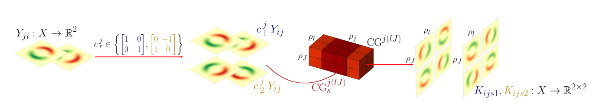
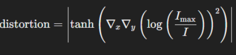
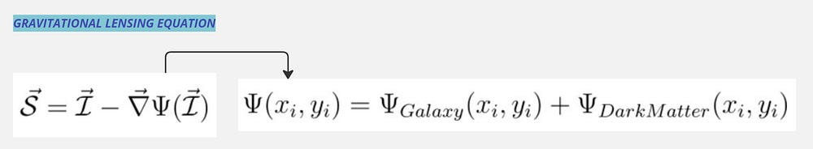
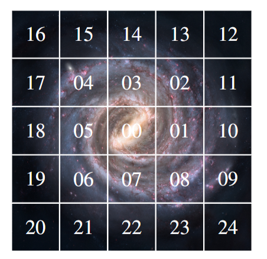

# AstroLens - Unified Vision Library for Astronomy

A unified library of vision models for astronomy: galaxy morphology
classification, strong gravitational lensing, and multimodal representation
learning, each a self-contained implementation behind one registry and a common
PyTorch interface, with pretrained weights where available.

## Table of Contents

- [Usage](#usage)
- [Astroformer](#astroformer)
- [Linformer](#linformer)
- [GCNN](#gcnn)
- [Lensiformer](#lensiformer)
- [AstroPT](#astropt)
- [Pretrained weights](#pretrained-weights)
- [Examples](#examples)
- [Resources](#resources)
- [Citations](#citations)

## Usage

```bash
pip install -e .
```

```python
import astrolens

astrolens.list_models()
model = astrolens.create_model("astroformer", num_classes=10)
```

## Astroformer


This [ICLR 2023 workshop paper](https://arxiv.org/abs/2304.05350) proposes a hybrid transformer-convolutional architecture, to learn efficiently on less amount of data, inspired by CoAtNet and MaxViT. First down-sampling the feature map via a multi-stage network with gradual pooling to reduce the spatial size and then employing the global relative attention. Found that the C-C-C-T design works much better than C-C-T-T which was adapted as the layout for CoAtNet. This is due to high generalization capability and training stability. Achieved 94.86% on [Galaxy10 DECals](https://huggingface.co/datasets/mwalmsley/galaxy10_decals).

```python
import torch
from astrolens.models.astroformer import AstroFormer

model = AstroFormer(img_size=256, in_chans=3, num_classes=10)
img = torch.randn(2, 3, 256, 256)
logits = model(img)
```

Or through the registry:

```python
import astrolens

model = astrolens.create_model("astroformer", num_classes=10)
```

## Linformer


This [paper](https://arxiv.org/abs/2110.01024) applies a Vision Transformer to galaxy morphology classification, replacing standard quadratic self-attention with [Linformer](https://arxiv.org/abs/2006.04768)'s linear-complexity low-rank attention approximation for efficiency. Achieved 80.55% overall accuracy on an 8-class [Galaxy Zoo 2](https://data.galaxyzoo.org/) dataset.

```python
import torch
from astrolens.models.linformer import Linformer

model = Linformer(img_size=224, in_chans=3, num_classes=8)
img = torch.randn(2, 3, 224, 224)
logits = model(img)
```

Or through the registry:

```python
import astrolens

model = astrolens.create_model("linformer", num_classes=8)
```

## GCNN



This [paper](https://arxiv.org/abs/2311.01500) builds group-equivariant CNNs for galaxy morphology classification that stay robust under image rotations and, optionally, reflections. Features are represented in the regular representation of a discrete rotation group `C_N` (or dihedral group `D_N` with reflections), and pooled to an invariant representation before classification. This module reimplements the group convolution natively in PyTorch (kernel rotation via bilinear interpolation, exact for `N` in `{1, 2, 4}`) rather than depending on the reference implementation's [`escnn`](https://github.com/QUVA-Lab/escnn) library. Trained on [Galaxy10 DECals](https://github.com/henrysky/Galaxy10).

```python
import torch
from astrolens.models.gcnn import GCNN

model = GCNN(N=8, reflections=True, img_size=255, num_classes=10)
img = torch.randn(2, 3, 255, 255)
logits = model(img)
```

Or through the registry, with named factories for each group (`gcnn_c1`...`gcnn_c16`, `gcnn_d1`...`gcnn_d16`):

```python
import astrolens

model = astrolens.create_model("gcnn_d16", num_classes=10)
```

## Lensiformer






This [NeurIPS 2023 ML4PS workshop paper](https://ml4physicalsciences.github.io/2023/files/NeurIPS_ML4PS_2023_214.pdf) (also called Lensformer) classifies dark-matter substructure (no substructure / CDM / axion) from strong gravitational lensing images. A physics-informed encoder, a Vision Transformer for Small Datasets, predicts a per-pixel scale field for a Singular Isothermal Sphere potential ansatz; the lens equation then warps the observed image into an estimated source-plane image, which a decoder cross-attends against the original to classify. Reported 90.3% accuracy on simulated HST-like lensing images, ahead of ResNet, Inception, and other ViT variants.

```python
import torch
from astrolens.models.lensiformer import Lensiformer

model = Lensiformer(img_size=64, in_chans=1, num_classes=3)
img = torch.randn(2, 1, 64, 64)
logits = model(img)
```

Or through the registry:

```python
import astrolens

model = astrolens.create_model("lensiformer", num_classes=3)
```

## AstroPT



This [paper](https://arxiv.org/abs/2405.14930) adapts a GPT-style causal transformer to galaxy images, autoregressively predicting each image patch from the ones before it to learn a general-purpose pretrained backbone, following [nanoGPT](https://github.com/karpathy/nanoGPT). Trained on the [Galaxies dataset](https://huggingface.co/datasets/Smith42/galaxies) of DESI Legacy Survey imagery.

```python
import torch
from astrolens.models.astropt import AstroPT

model = AstroPT(img_size=224, in_chans=3, patch_size=16, num_classes=10)
img = torch.randn(2, 3, 224, 224)
logits = model(img)
```

Or through the registry:

```python
import astrolens

model = astrolens.create_model("astropt", num_classes=10)
```

## Pretrained weights

`astrolens.pretrained` loads released checkpoints into the matching model,
with the optional `huggingface_hub` dependency (`pip install astrolens[pretrained]`).

| Model | Source | Params | Modality |
|---|---|---|---|
| AstroPT | [`Smith42/astroPT`](https://huggingface.co/Smith42/astroPT) | 89M | image |
| AION-1 | [`polymathic-ai/aion-base`](https://huggingface.co/polymathic-ai/aion-base) | 300M | 39 modalities |
| AstroCLIP | [`polymathic-ai/astroclip`](https://huggingface.co/polymathic-ai/astroclip) | 302M image + 43M spectrum | image + spectrum |

### AstroPT

```python
import torch
from astrolens.pretrained.astropt import load_pretrained_astropt

model = load_pretrained_astropt(img_size=224, device=torch.device("cpu"), num_classes=10)
```

### AstroCLIP

Install per the [AstroCLIP README](https://github.com/PolymathicAI/AstroCLIP#installation)
(`pip install astrolens[astroclip]`, plus separate `--no-deps` installs for `dinov2` and `astroclip`):

```python
from astrolens.pretrained.astroclip import load_pretrained_astroclip

model = load_pretrained_astroclip(device="cpu")
embedding = model(image, input_type="image")
```

### AION-1

```python
from astrolens.pretrained.aion import load_pretrained_aion

model, codec_manager = load_pretrained_aion("aion-base", device="cpu")
```

Later [this paper](https://openreview.net/pdf?id=xRD5qFxcdW) & [Code](https://github.com/MaxRonce/foundation-models-benchmark.git) benchmarked these multimodal models for unsupervised discovery in large multimodal astrophysical datasets.

## Examples

See [`examples/README.md`](examples/README.md) for full details.

### Training

- [`examples/linformer_training.ipynb`](examples/linformer_training.ipynb):
  trains `Linformer` for Galaxy Zoo 10 morphology classification on
  [`UniverseTBD/mmu_gz10`](https://huggingface.co/datasets/UniverseTBD/mmu_gz10).
- [`examples/gcnn_training.ipynb`](examples/gcnn_training.ipynb):
  trains the group-equivariant `gcnn_d4` on the same dataset and saves a
  checkpoint for `gcnn_analysis.ipynb`.
- [`examples/astropt_pretraining.ipynb`](examples/astropt_pretraining.ipynb):
  pretrains `AstroPT` from scratch with the autoregressive next-patch
  objective on [`Smith42/galaxies`](https://huggingface.co/datasets/Smith42/galaxies).
- [`examples/astropt_finetuning.ipynb`](examples/astropt_finetuning.ipynb):
  loads a released `Smith42/astroPT` checkpoint and LoRA-finetunes a
  classification head on `UniverseTBD/mmu_gz10`.

### Similarity search

- [`examples/astropt_similarity_search.ipynb`](examples/astropt_similarity_search.ipynb):
  uses the finetuned `AstroPT` checkpoint as a frozen feature extractor for
  cosine-similarity nearest-neighbor retrieval on `Smith42/galaxies`.
- [`examples/aion_embeddings.ipynb`](examples/aion_embeddings.ipynb):
  loads the released `polymathic-ai/aion-base` checkpoint and extracts
  frozen image embeddings from real Legacy Survey flux cutouts for
  cosine-similarity nearest-neighbor retrieval.
- [`examples/aion_lsdb_embeddings.ipynb`](examples/aion_lsdb_embeddings.ipynb):
  the same AION-1 embedding search, sourcing flux cutouts via
  [`lsdb`](https://github.com/astronomy-commons/lsdb) cone search against
  the 61 TB `hugging-science/mmu_legacysurvey_dr10_south_21` HATS catalog
  — the raw-flux catalog family AION-1 was itself pretrained on.
- [`examples/astroclip_similarity_search.ipynb`](examples/astroclip_similarity_search.ipynb):
  loads the released `polymathic-ai/astroclip` checkpoint and extracts frozen
  image embeddings from real g,r,z Legacy Survey flux cutouts for in-modal
  cosine-similarity nearest-neighbor retrieval.

### Anomaly detection

- [`examples/astropt_anomaly_detection.ipynb`](examples/astropt_anomaly_detection.ipynb):
  uses the same frozen `AstroPT` embeddings for outlier detection (Local
  Outlier Factor) on `Smith42/galaxies`.

### Interpretability

- [`examples/gcnn_analysis.ipynb`](examples/gcnn_analysis.ipynb):
  probes the trained GCNN with a one-pixel adversarial attack and a
  latent-space visualization of its learned embeddings.

## Resources

* [pytorch-image-models](https://github.com/huggingface/pytorch-image-models): The largest collection of PyTorch image encoders / backbones.
* [DeepLense](https://github.com/ML4SCI/DeepLense/tree/main): Explores cutting-edge Machine Learning techniques for the study of Strong Gravitational Lensing and Dark Matter Sub-structure, using both simulated and real lensing images.
* [lucidrains/vit-pytorch](https://github.com/lucidrains/vit-pytorch): Implementation of Vision Transformer, a simple way to achieve SOTA in vision.

## Citations

If you find this library useful in your research, please consider citing it:

```
@software{md_khairul_islam_2026_22088930,
  author       = {Md. Khairul Islam},
  title        = {khairulislam/AstroLens: v1.0.0},
  month        = aug,
  year         = 2026,
  publisher    = {Zenodo},
  version      = {v1.0.0},
  doi          = {10.5281/zenodo.22088930},
  url          = {https://doi.org/10.5281/zenodo.22088930},
}
```

And the original works behind the included models:

```
@article{dagli2023astroformer,
  title={Astroformer: More Data Might Not be All You Need for Classification},
  author={Dagli, Rishit},
  journal={arXiv preprint arXiv:2304.05350},
  year={2023}
}

@article{lin2021galaxy,
  title={Galaxy Morphological Classification with Efficient Vision Transformer},
  author={Lin, Joshua Yao-Yu and Liao, Song-Mao and Huang, Hung-Jin and Kuo, Wei-Ting and Ou, Olivia Hsuan-Min},
  journal={arXiv preprint arXiv:2110.01024},
  year={2021}
}

@misc{pandya2023e2,
  title={E(2) Equivariant Neural Networks for Robust Galaxy Morphology Classification},
  author={Sneh Pandya and Purvik Patel and Franc O and Jonathan Blazek},
  year={2023},
  eprint={2311.01500},
  archivePrefix={arXiv},
  primaryClass={astro-ph.GA}
}

@inproceedings{veloso2023lensformer,
  title={Lensformer: A Physics-Informed Vision Transformer for Gravitational Lensing},
  author={Vel{\^o}so, Lucas J. and Toomey, Michael W. and Gleyzer, Sergei},
  booktitle={Machine Learning and the Physical Sciences Workshop, NeurIPS},
  year={2023}
}

@article{smith2024astropt,
  title={AstroPT: Scaling Large Observation Models for Astronomy},
  author={Smith, Michael J. and others},
  journal={arXiv preprint arXiv:2405.14930},
  year={2024}
}

@article{parker2025aion,
  title={AION-1: Omnimodal Foundation Model for Astronomical Sciences},
  author={Parker, Liam and Lanusse, Francois and Shen, Jeff and Liu, Ollie and Hehir, Tom and Sarra, Leopoldo and Meyer, Lucas and Bowles, Micah and Wagner-Carena, Sebastian and Qu, Helen and Golkar, Siavash and Bietti, Alberto and Bourfoune, Hatim and Casserau, Nathan and Cornette, Pierre and Hirashima, Keiya and Krawezik, Geraud and Ohana, Ruben and Lourie, Nicholas and McCabe, Michael and Morel, Rudy and Mukhopadhyay, Payel and Pettee, Mariel and Regaldo-Saint Blancard, Bruno and Cho, Kyunghyun and Cranmer, Miles and Ho, Shirley},
  journal={arXiv preprint arXiv:2510.17960},
  year={2025}
}

@article{parker2024astroclip,
  title={AstroCLIP: a cross-modal foundation model for galaxies},
  author={Parker, Liam and Lanusse, Francois and Golkar, Siavash and Sarra, Leopoldo and Cranmer, Miles and Bietti, Alberto and Eickenberg, Michael and Krawezik, Geraud and McCabe, Michael and Morel, Rudy and Ohana, Ruben and Pettee, Mariel and R{\'e}galdo-Saint Blancard, Bruno and Cho, Kyunghyun and Ho, Shirley},
  journal={Monthly Notices of the Royal Astronomical Society},
  volume={531},
  number={4},
  pages={4990--5011},
  year={2024},
  doi={10.1093/mnras/stae1450}
}
```